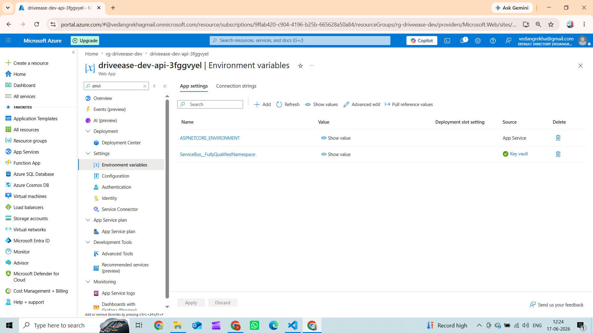
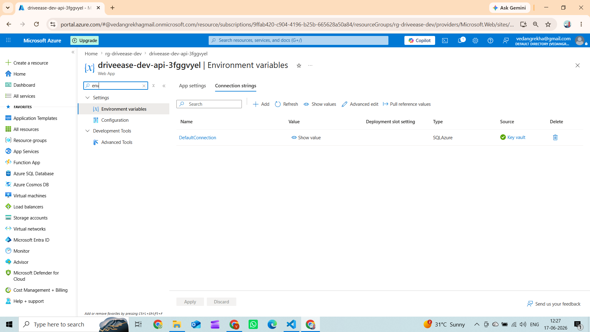
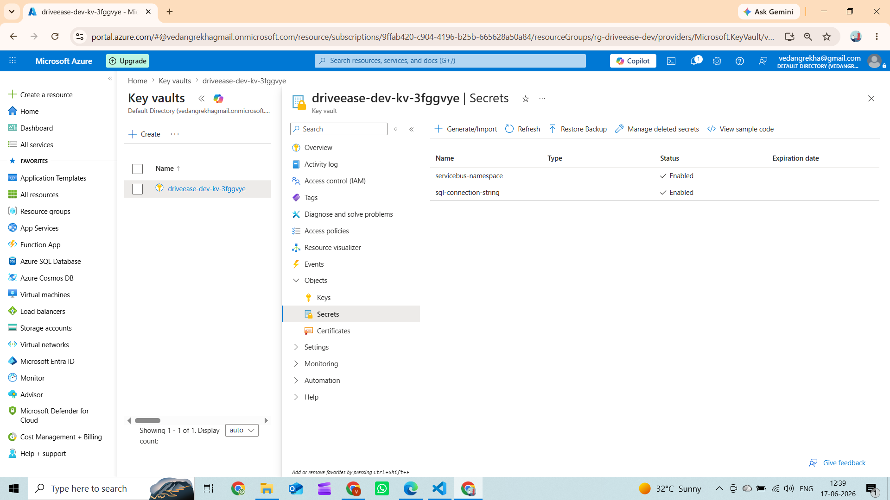
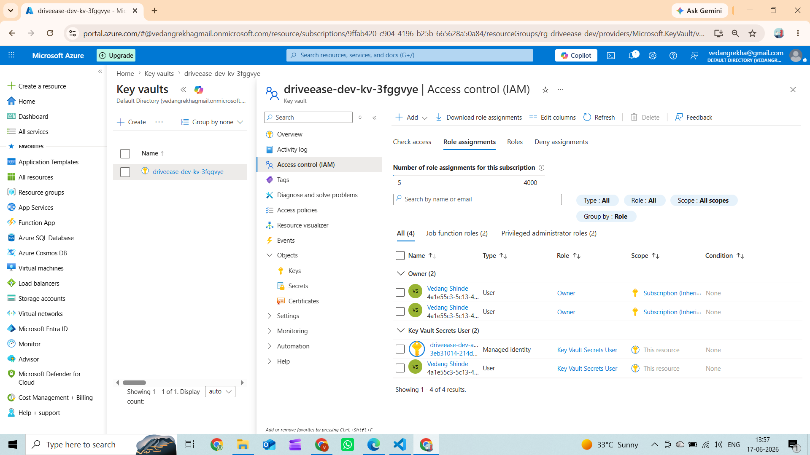
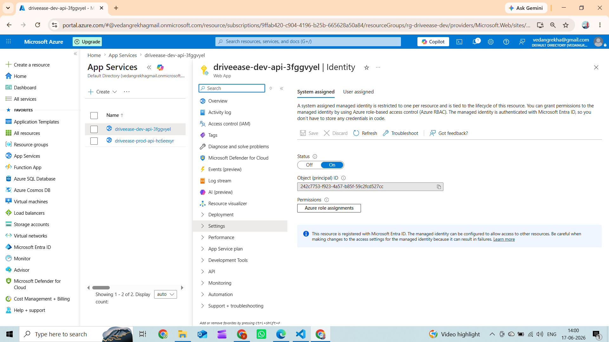

# Day 25 — Identity End-to-End

## Exercise: MI wiring + Key Vault reference. Zero secrets in app settings.

---

## 1. App Settings — Zero plaintext secrets

**`infra/modules/api.bicep`**

```bicep
appSettings: [
  {
    name:  'ASPNETCORE_ENVIRONMENT'
    value: environmentName == 'prod' ? 'Production' : 'Development'
  }
  // No SAS key. MI resolves this from Key Vault at runtime.
  {
    name:  'ServiceBus__FullyQualifiedNamespace'
    value: '@Microsoft.KeyVault(VaultName=${keyVaultName};SecretName=servicebus-namespace)'
  }
]
connectionStrings: [
  // No password. MI resolves this from Key Vault at runtime.
  {
    name:             'DefaultConnection'
    connectionString: '@Microsoft.KeyVault(VaultName=${keyVaultName};SecretName=sql-connection-string)'
    type:             'SQLAzure'
  }
]
```

The only app setting with a real value is `ASPNETCORE_ENVIRONMENT`. Everything else is a `@Microsoft.KeyVault()` reference.

---

## 2. Key Vault stores the secrets (no password in SQL string)

**`infra/modules/keyvault.bicep`**

```bicep
// sql-connection-string value (from sql.bicep output):
// Server=tcp:...;Database=driveease;Authentication=Active Directory Managed Identity;Encrypt=True;...
// ↑ No Password= field at all.

resource sqlConnSecret 'Microsoft.KeyVault/vaults/secrets@2023-07-01' = {
  name: 'sql-connection-string'   // MI auth, no password
}

resource sbNamespaceSecret 'Microsoft.KeyVault/vaults/secrets@2023-07-01' = {
  name: 'servicebus-namespace'    // FQDN only, no SAS key
}
```

---

## 3. MI wiring — 3 RBAC role assignments

**`infra/main.bicep`**

```
App Service MI (SystemAssigned)
  ├── Key Vault Secrets User      → resolves @Microsoft.KeyVault() references
  ├── Service Bus Data Owner      → send/receive without SAS key
  └── SQL AAD Administrator       → connect with "Authentication=Active Directory Managed Identity"
```

---

## 4. Code uses DefaultAzureCredential — no credentials in source

**`src/DriveEase.Api/Messaging/AzureServiceBusEventBus.cs`**

```csharp
// Picks up system-assigned MI automatically on Azure App Service
_client = new ServiceBusClient(fullyQualifiedNamespace, new DefaultAzureCredential());
```

**`src/DriveEase.Api/appsettings.json`** — only logging config, no secrets:

```json
{ "Logging": { ... }, "AllowedHosts": "*" }
```

---

## 5. Entra ID — API endpoints protected

**`src/DriveEase.Api/Program.cs`**

```csharp
builder.Services.AddMicrosoftIdentityWebApiAuthentication(builder.Configuration, "AzureAd");
app.UseAuthentication();
app.UseAuthorization();
```

All controllers decorated with `[Authorize]` — returns **401 Unauthorized** without a valid Azure AD token.

---

## Result

Zero secrets anywhere — no passwords, no SAS keys, no connection strings in source code or app settings.

---

## Screenshots

### 1. App Settings — Service Bus KV reference (no plaintext)

The `ServiceBus__FullyQualifiedNamespace` app setting holds a `@Microsoft.KeyVault()` reference, not a SAS connection string.
The App Service MI resolves this at runtime — no secret is ever stored in the portal or source code.

### 2. Connection Strings — SQL KV reference (no plaintext)

The `DefaultConnection` string is a Key Vault reference pointing to the MI-based SQL connection string.
There is no `Password=` field anywhere — authentication is handled entirely by Managed Identity.

### 3. Key Vault Secrets — Unauthorized before RBAC

The Key Vault uses RBAC authorization mode — even the owner account is denied without an explicit role assignment.
This proves secrets are locked down and only the App Service MI (granted Key Vault Secrets User) can read them.

### 4. MI Wiring — Key Vault Role Assignments

The App Service system-assigned MI has been granted the `Key Vault Secrets User` role on the Key Vault.
This is what allows the `@Microsoft.KeyVault()` app setting references to resolve at runtime.

### 5. App Service — Managed Identity Enabled

System-assigned Managed Identity is enabled on the App Service with a unique Object (principal) ID in Azure AD.
This identity is used for all three RBAC role assignments — Key Vault, Service Bus, and SQL AAD Admin.
